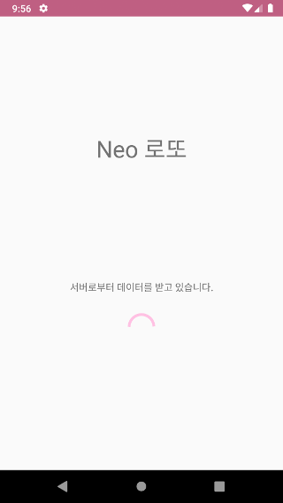
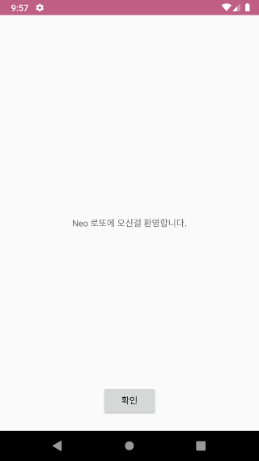
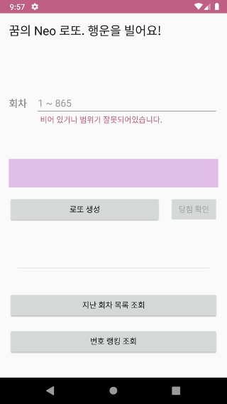
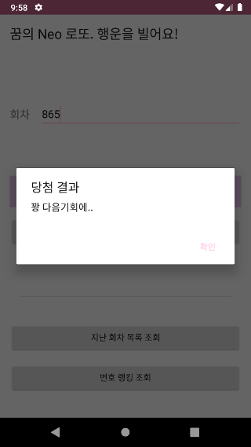
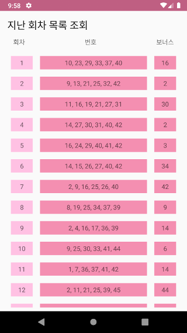
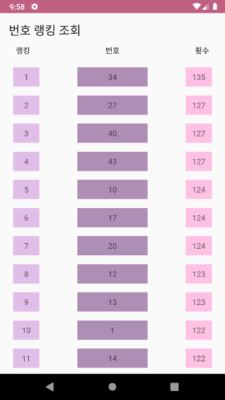
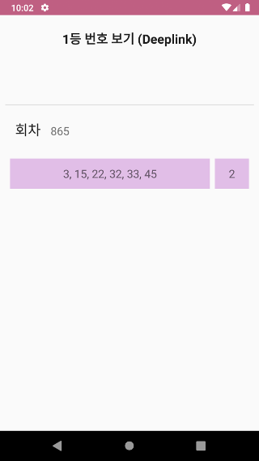

### Neo 로또

> 마이크로 프로젝트 Neo 로또는 동행로또 API를 사용하여 간단한 기능을 제공합니다. 랜덤 로또 번호를 생성하여 특정 회차에 맞춰보는 기능과 지난 회차 목록 조회 그리고 번호 별 랭킹정보를 제공합니다.


#### 앱 구성

* 안드로이드
* Kotlin
* MVVM
* JetPack (Android Archtecture Component)
  * Room
  * ViewModel
  * Paging (Lazy loading)
* 3rd Party
  * RxJava2
  * Retrofit2
  * Timber (Logger)


#### 패키지 구조

* com.github.haejung83
  * data
    * 데이터 레이어: Room을 사용한 로컬 캐시, Retrofit2를 사용한 서버 데이터 획득
  * extend
    * 확장 함수
  * presentation
    * UI 레이어: 각 화면 별 세부 패키지로 존재


#### 빌드 옵션

* 임의의 상수 값을 정의하여 서버에서 데이터 획득 및 캐시 크기를 지정합니다.
* 파일: LotteryConstants.kt

```kotlin
const val LOTTERY_DRAW_NUMBER_CACHE_LIMIT = 865
```


#### 간략 설명

* 데이터 레이어

  ```kotlin
  interface LotteryDataSource {
      fun getLotteries(): Flowable<List<Lottery>>
      fun getLotteriesForPaging(): DataSource.Factory<Int, Lottery>
      fun getLotteryByDrawNumber(drawNumber: Int): Flowable<Lottery>
      fun insert(vararg lotteries: Lottery): Completable
      fun update(lottery: Lottery): Completable
      fun deleteByDrawNumber(drawNumber: Int): Completable
      fun deleteAll(): Completable
      fun count(): Single<Int>
      fun refresh(): Completable
  }
  ```

  * LotteryDataSource 인터페이스로 데이터를 제공
    * 구현체 LotteryRepository
  * 데이터 조회/삽입/삭제/갱신 등의 기능을 제공
  * getLotteriesForPaging()은 JetPack의 PageList에 맞게 제공, 나머지는 Rx형으로 제공
  * refresh()에서 로컬 데이터(Room)에 서버로 부터 획득한 데이터를 저장

* UI 레이어

  * base

    * Data Binding을 위한 추상 클래스 (AppCompatActivity, Fragment, ViewModel)

  * splash

    * 최초 실행 화면
    * 만약 최초 실행 시, 로컬 캐시(Room)에 데이터가 존재 하지 않을경우 LotteryRepository에 refresh()를 호출하여 로컬 캐시를 갱신 함
    * 최초 로컬 캐시를 갱신하고 welcome으로 이동
    * 두 번째 부터는 main으로 이동

  * welcome

    * 단순 환영 메시지 표시
    * main으로 이동

  * main

    * 랜덤 로또 번호 생성
    * 과거의 특정 회차를 지정하여 랜덤 생성된 로또 번호화 비교 (다이어 로그로 표시)
    * 지난 회차 목록 조회
    * 각 번호별 랭킹 조회

  * history

    * 지난 회차 목록 조회
    * JetPack의 PageList를 사용하여 Lazy Loading으로 표시

  * frequently

    * 각 변호별 랭킹 조회 (많이 출현한 번호를 계산하여 랭킹으로 표시)

  * retrieve

    * Deeplink로 앱 호출 시 함께 전달 되는 특정 회차의 당첨 번호를 표시

    * 실행 방법 (예: 865회)

      ```shell
      adb shell am start -a android.intent.action.VIEW -d lottery://865 com.github.haejung83
      ```

#### 스크린샷

* Splash




* Welcome



* Main



* Main -> Dialog (당첨 결과)



* 지난 회차 조회



* 각 번호별 랭킹 조회



* 특정 회차 당첨 번호 조회 (Deeplink)




